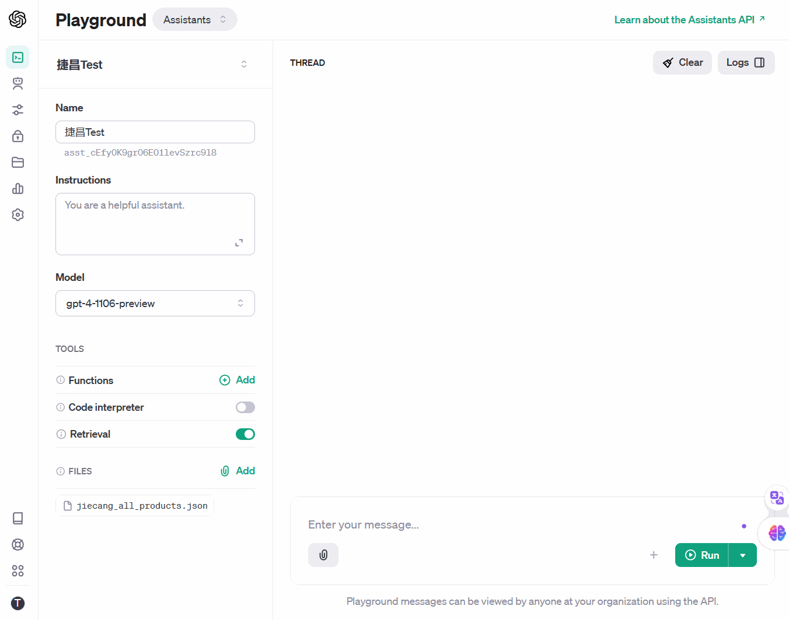

[](https://pypi.org/project/gpt-web-crawler/) [](https://github.com/Tim-Saijun/gpt-web-crawler/actions/workflows/python-publish.yml)[](https://pypi.org/project/gpt-web-crawler/)   [](README-Zh.md) [](README.md)

## Introduction
GPT-Web-Crawler is a web crawler based on python and puppeteer. It can crawl web pages and extract content (including WebPages' title,url,keywords,description,all text content,all images and screenshot) from web pages. It is very easy to use and can be used to crawl web pages and extract content from web pages in a few lines of code. It is very suitable for people who are not familiar with web crawling and want to use web crawling to extract content from web pages.


The output of the spider can be a json file, which can be easily converted to a csv file, imported into a database or building an AI agent.

## Getting Started
Step1. Install the package.
```bash
pip install gpt-web-crawler
```
Step2. Copy [config_template.py](config_template.py) and rename it to config.py. Then, edit the config.py file to config the openai api key and other settings, if you need use ProSpider to help you extract content from web pages. If you don't need to use ai help you extract content from web pages, **you can keep the config.py file unchanged**.

Step3. Run the following code to start a spider.
```python
from gpt_web_crawler import run_spider,NoobSpider
run_spider(NoobSpider, 
           max_page_count= 10 ,
           start_urls="https://www.jiecang.cn/", 
           output_file = "test_pakages.json",
           extract_rules= r'.*\.html' )
```

## Spiders
In the above code, the NoobSpider is used. There are four spiders in the package, which are NoobSpider, CatSpider, ProSpider and LionSpider. They are different in the content they can extract from the web page. The following table shows the differences between them.

| Spider Type | Description                                      | Return Content                                   |
|-------------|--------------------------------------------------|--------------------------------------------------|
| NoobSpider  | Basic web page scraping                          |- titile <br>- url<br>- keywords<br>- description<br>- body :all text content of web page|
| CatSpider   | Web page scraping with screenshots               |- titile <br>- url<br>- keywords<br>- description<br>- body :all text content of web page <br>- screenshot_path|
| ProSpider   | Web page scraping with AI-extracted content      |- titile <br>- url<br>- keywords<br>- description<br>- body :all text content of web page <br>- ai_extract_content : gpt's extraction of body text|
| LionSpider  | Web page scraping with all images extracted      |- titile <br>- url<br>- keywords<br>- description<br>- body :all text content of web page <br>- directory : the directory of all pics on web page|

### Cat Spider
Cat spider is a spider that can take screenshots of web pages. It is based on the Noob spider and uses puppeteer to simulate browser operations to take screenshots of the entire web page and save it as an image.
So when you use the Cat spider, you need to install puppeteer first.You can refer to [this answer](https://github.com/Tim-Saijun/gpt-web-crawler/commit/dd4edfe83209026a0e74dae8b9b3e6d5d9b9d90c#commitcomment-146072110) to install npm, and then use the following command to install puppeteer:
```bash
npm install puppeteer
```

## TODO
- [ ] 支持无需配置config.py
- [ ] 爬虫更多自定义内容
